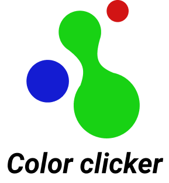
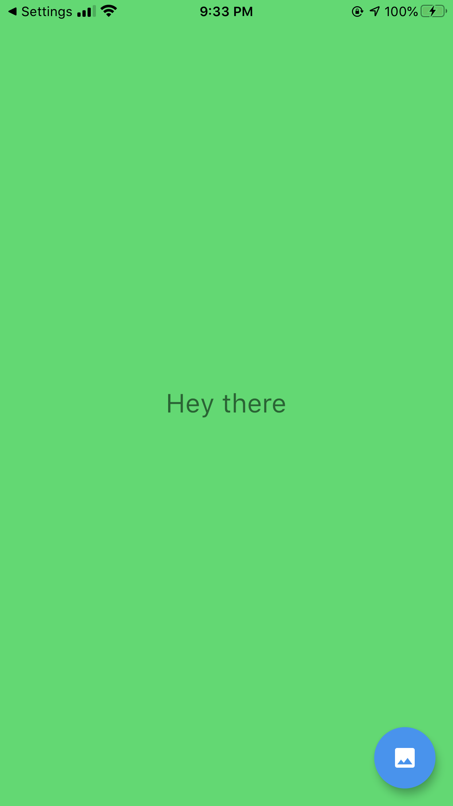

# 🎨 ColorClicker

Flutter application for random color generation. Entirely written in Dart and Flutter. Application is ready for Android and iOS.

## 📷 Media 
<table>
<tr><h3>🤖Android</h3></tr>
<tr>
<td>

</td>
<td>

</td>
<td>

</td>
</tr>
</table>
<table>
<tr><h3>📱 iOS</h3></tr>
<tr>
<td>

</td>
<td>

</td>
<td>

</td>
</tr>
</table>

## 👷 To do
- API for search images by color
- Write more tests  
- Code refactor  
- Documentation
